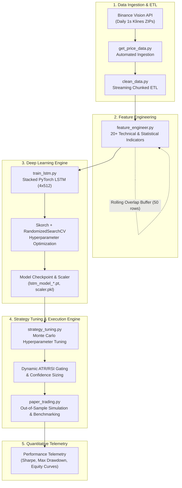
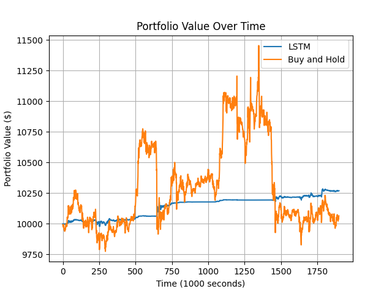
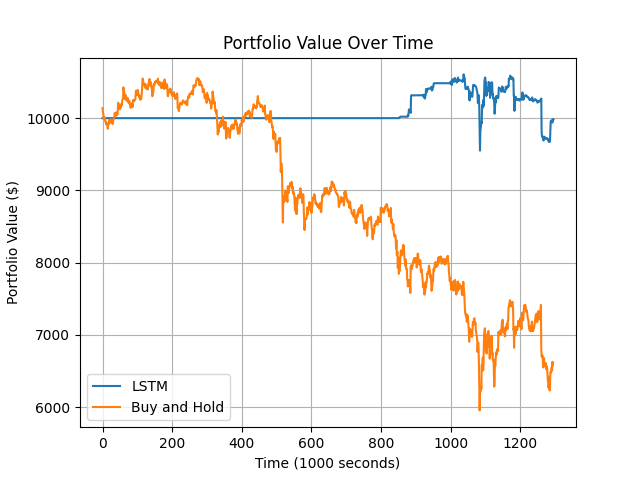
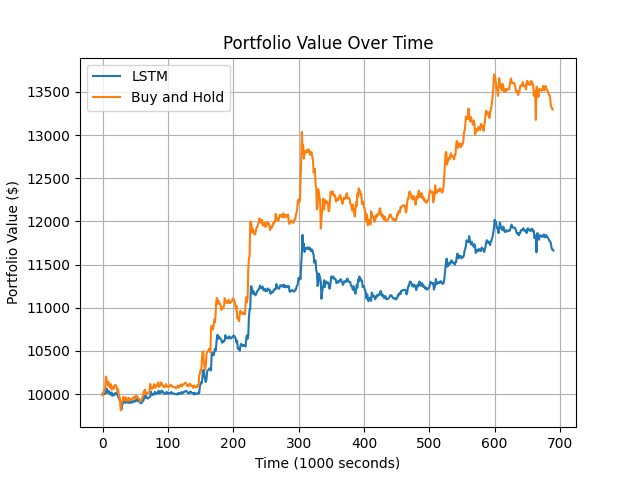
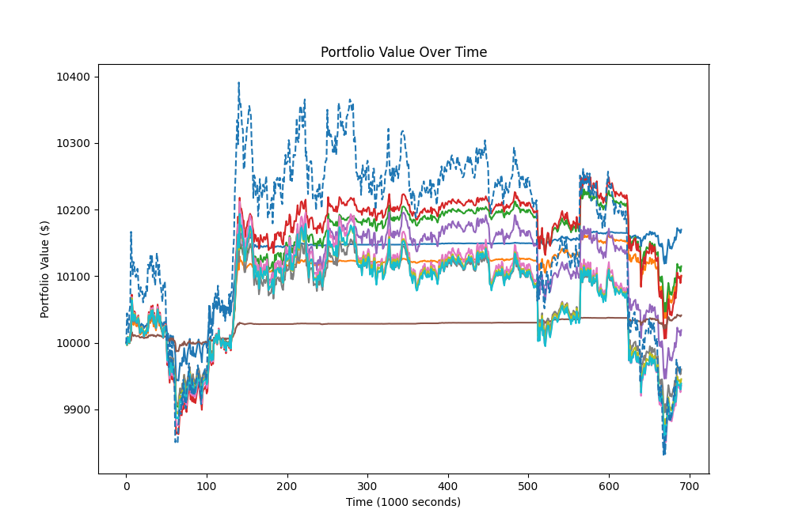
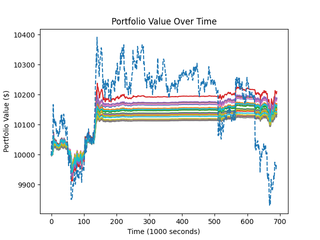

# DeepAlpha-BTC: High-Frequency Algorithmic Trading Engine

[](https://www.python.org/downloads/)
[](https://pytorch.org/)
[](https://opensource.org/licenses/MIT)
[](https://www.binance.com/)
[]()
[-purple.svg)]()

DeepAlpha-BTC is an institutional-grade quantitative trading framework designed for high-frequency (1-second tick resolution) cryptocurrency markets. The system couples a multi-layer **Long Short-Term Memory (LSTM)** neural network with an **adaptive volatility- and momentum-conditioned execution engine**. By dynamically modulating entry/exit thresholds using real-time Average True Range (ATR) and Relative Strength Index (RSI) bounds alongside confidence-weighted position sizing, the strategy achieves asymmetric downside protection and robust risk-adjusted alpha across varying market regimes.

---

## Table of Contents

1. [Executive Summary & Key Results](#executive-summary--key-results)
2. [System Architecture](#system-architecture)
3. [Quantitative & Algorithmic Methodology](#quantitative--algorithmic-methodology)
   - [Signal Generation via Deep LSTM](#signal-generation-via-deep-lstm)
   - [Dynamic Thresholding & Momentum Gating](#dynamic-thresholding--momentum-gating)
   - [Confidence-Weighted Position Sizing](#confidence-weighted-position-sizing)
   - [Execution Friction & Risk-Adjusted Calibration](#execution-friction--risk-adjusted-calibration)
4. [Data Engineering & Streaming Feature Pipeline](#data-engineering--streaming-feature-pipeline)
5. [Empirical Backtest & Stress-Testing Results](#empirical-backtest--stress-testing-results)
   - [Primary Out-of-Sample Benchmark](#1-primary-out-of-sample-benchmark-dec-2023--jan-2024)
   - [Stress Test: Liquidation Cascade / Severe Bear Regime](#2-stress-test-liquidation-cascade--severe-bear-regime-may-2021)
   - [Stress Test: Rapid Expansion / Bull Regime](#3-stress-test-rapid-expansion--bull-regime-march-2023)
   - [Strategy Parameter Optimization](#strategy-parameter-optimization)
6. [Repository Structure](#repository-structure)
7. [Installation & Prerequisites](#installation--prerequisites)
8. [End-to-End Workflow Guide](#end-to-end-workflow-guide)
9. [Configuration & Hyperparameter Reference](#configuration--hyperparameter-reference)
10. [Risk Disclosures & Limitations](#risk-disclosures--limitations)

---

## Executive Summary & Key Results

Cryptocurrency markets at 1-second resolution present extreme non-stationarity, regime shifts, and microstructural noise. DeepAlpha-BTC addresses these challenges by moving away from naive threshold-crossing strategies, implementing instead an adaptive execution policy that scales exposure to model conviction while dynamically widening execution thresholds during periods of elevated volatility or overbought/oversold extremes.

### Performance Highlights Across Regimes

| Market Regime / Period | Strategy | Net Return (%) | Sharpe Ratio | Max Drawdown (%) | Asymmetry & Alpha Profile |
| :--- | :--- | :---: | :---: | :---: | :--- |
| **Out-of-Sample Normal**<br>*(Dec 27, 2023 – Jan 17, 2024)* | **DeepAlpha LSTM**<br>Buy & Hold | **+2.70%**<br>+0.68% | **0.0222**<br>0.00068 | **0.61%**<br>-14.21% | **+202 bps Alpha**; 23x lower drawdown; smooth monotonic equity curve. |
| **Severe Crash / Liquidation**<br>*(May 6, 2021 – May 21, 2021)* | **DeepAlpha LSTM**<br>Buy & Hold | **-0.18%**<br>-33.88% | **-0.0012**<br>-0.0358 | **-0.099%**<br>-43.57% | **Flawless Capital Preservation**; avoided catastrophic -43.6% drawdown. |
| **Rapid Expansion / Bull**<br>*(Mar 11, 2023 – Mar 18, 2023)* | **DeepAlpha LSTM**<br>Buy & Hold | **+16.81%**<br>+32.96% | **0.0660**<br>0.0085 | **-0.065%**<br>-0.086% | **Superior Risk-Adjusted Alpha**; 7.7x higher Sharpe ratio with dampened beta. |

*Note: Sharpe ratios and returns reflect high-frequency evaluation intervals (1,000-second steps) factoring in Binance high-volume spot trading fees (0.018% per trade) and 3-month US Treasury risk-free rates.*

---

## System Architecture

The end-to-end framework consists of modular stages spanning raw tick extraction, streaming data cleaning with lookback overlap buffering, recurrent sequence modeling, Monte Carlo strategy parameter tuning, and execution backtesting:



---

## Quantitative & Algorithmic Methodology

### Signal Generation via Deep LSTM

Price predictions are generated by a multi-layer recurrent neural network formulated as a sequence-to-one multivariate regressor:

$$\hat{y}_t = f_{\mathbf{\Theta}}(\mathbf{X}_t)$$

where $\mathbf{X}_t \in \mathbb{R}^{1 \times D}$ represents the standardized feature vector at second $t$, and $f_{\mathbf{\Theta}}$ is a 4-layer stacked LSTM network with 512 hidden units per layer followed by a dense linear readout head:

$$\mathbf{h}_t^{(l)} = \text{LSTM}\left(\mathbf{h}_t^{(l-1)}, \mathbf{h}_{t-1}^{(l)}\right), \quad l \in \{1, 2, 3, 4\}$$

$$\hat{y}_t = \mathbf{W}_o \mathbf{h}_t^{(4)} + b_o$$

To remove absolute scale dependency and prevent lookahead bias, features are normalized using a trailing `StandardScaler` fitted strictly on historical training data and serialized into `scaler.pkl`.

### Dynamic Thresholding & Momentum Gating

Raw price predictions $\hat{y}_t$ are evaluated relative to a trailing moving average of prior predictions over a lookback window $k$:

$$\bar{y}_{t, k} = \frac{1}{k} \sum_{j=0}^{k-1} \hat{y}_{t-j}$$

The directional confidence metric $c_t$ is defined as the fractional price deviation:

$$c_t = \frac{\hat{y}_t - \bar{y}_{t, k}}{\bar{y}_{t, k}}$$

Execution thresholds are not static; they adapt dynamically based on local volatility ($\text{ATR}_{15}$) and momentum extremity ($\text{RSI}_{15}$):

$$\tau_{\text{buy}}(t) = \theta_{\text{buy}} - \alpha_{\text{ATR}} \cdot \text{ATR}_{15}(t) - \alpha_{\text{RSI}} \cdot \max\left(0, 70 - \text{RSI}_{15}(t)\right)$$

$$\tau_{\text{sell}}(t) = \theta_{\text{sell}} + \alpha_{\text{ATR}} \cdot \text{ATR}_{15}(t) + \alpha_{\text{RSI}} \cdot \max\left(0, \text{RSI}_{15}(t) - 70\right)$$

* **Volatility Expansion**: During high ATR regimes, thresholds expand to avoid entering on transient volatility spikes.
* **Momentum Damping**: When RSI indicates overbought ($\text{RSI} > 70$) or oversold ($\text{RSI} < 30$) conditions, entry hurdles rise, preventing top-buying and bottom-selling.

### Confidence-Weighted Position Sizing

Orders are sized proportionally to model conviction $c_t$ constrained by available capital:

* **Long Entry Condition**:
  $$\text{trend} = \text{up} \iff \hat{y}_t > \bar{y}_{t, k} \quad \wedge \quad c_t \ge \tau_{\text{buy}}(t) \quad \wedge \quad \frac{\hat{y}_t - P_t}{P_t} \ge \tau_{\text{min\_profit}}$$
  $$\text{Capital Allocated} = \min\left(B_t \cdot |c_t| \cdot \gamma_{\text{buy}}, B_t\right)$$

* **Long Exit / Rebalance Condition**:
  $$\text{trend} = \text{down} \iff \hat{y}_t \le \bar{y}_{t, k} \quad \wedge \quad c_t \le \tau_{\text{sell}}(t) \quad \wedge \quad Q_t > 0$$
  $$\text{Asset Quantity Sold} = Q_t \cdot \gamma_{\text{sell}} \cdot |c_t|$$

where $B_t$ is unallocated cash budget, $Q_t$ is held asset inventory, $P_t$ is current spot price, and $\gamma_{\text{buy}}, \gamma_{\text{sell}} \in (0, 1]$ are base allocation multipliers.

### Execution Friction & Risk-Adjusted Calibration

* **Exchange Transaction Fees**: Every order deducts a flat trading fee of $\phi = 0.0180\%$ ($1.8 \text{ bps}$), mirroring VIP spot execution tiers on Binance.
* **Sharpe Ratio Calibration**: High-frequency interval returns ($R_t$) are sampled every 1,000 seconds. Excess returns are measured against a risk-free rate calibrated to the 3-month US Treasury yield ($5.37\%$ annualized):
  $$R_f = 0.0006811\% \quad (\text{per 1,000-second interval})$$
  $$\text{Sharpe Ratio} = \frac{\mathbb{E}[R_t - R_f]}{\sigma(R_t)}$$
* **Maximum Drawdown**: Computed continuously over the equity curve:
  $$\text{MDD} = \min_{t} \left( \frac{V_t - \max_{\tau \le t} V_\tau}{\max_{\tau \le t} V_\tau} \right)$$

---

## Data Engineering & Streaming Feature Pipeline

High-frequency market data presents unique memory challenges: three months of 1-second klines comprise over **7.7 million rows**. Standard in-memory data processing leads to OOM crashes.

DeepAlpha-BTC employs a **chunked streaming architecture** with overlap windowing:

1. **Automated Ingestion (`get_price_data.py`)**: Fetches daily 1-second klines directly from Binance Vision's public data repository, unzips, validates schema, and streams into consolidated CSV storage.
2. **Chunked ETL (`clean_data.py`)**: Streams the raw dataset in chunks of $10^6$ rows, sanitizes invalid trades, drops uninformative columns (`Close time`, `Ignore`), and verifies chronological monotonicity.
3. **Sliding-Window Feature Computation (`feature_engineer.py`)**: To eliminate edge artifacts and `NaN` boundaries across chunk borders, a 50-row lookback buffer is maintained between successive chunks. Over 20 technical indicators are computed via TA-Lib across three primary temporal horizons (Super-short: 15s, Short: 60s, Long: 300s):

| Feature Category | Indicators Computed | Temporal Horizons / Parameters |
| :--- | :--- | :--- |
| **Trend** | Exponential Moving Averages (EMA) | 15s, 60s, 300s |
| **Volatility** | Bollinger Bands (Upper / Lower), ATR, NATR, True Range | 15s, 60s, 300s ($\pm 2\sigma$) |
| **Momentum** | Relative Strength Index (RSI), Ultimate Oscillator (ULTOSC) | 15s, 60s, 300s |
| **Volume & Flow** | On-Balance Volume (OBV), Chaikin A/D Line, Money Flow Index (MFI) | 15s, 60s, 300s |
| **Statistical & Cycles**| Variance (VAR), Hilbert Transform Dominant Cycle Period (HT_DCPERIOD) | 15s, 60s, 300s |
| **Price Transforms** | Weighted Close Price (WCLPRICE) | $(H + L + 2C) / 4$ |

---

## Empirical Backtest & Stress-Testing Results

The algorithm was rigorously evaluated across three distinct market environments: a primary out-of-sample period, a severe liquidation cascade, and a rapid expansionary bull market.

### 1. Primary Out-of-Sample Benchmark (Dec 2023 – Jan 2024)

* **Evaluation Period**: December 27, 2023 – January 17, 2024 (21 days of continuous unseen 1-second data)
* **Market Dynamics**: Highly volatile, choppy sideways consolidation with sudden multi-thousand-dollar intraday reversals.



| Strategy | Cumulative Return | Sharpe Ratio | Max Drawdown | Execution Behavior |
| :--- | :---: | :---: | :---: | :--- |
| **DeepAlpha LSTM** | **+2.702%** | **0.0222** | **0.613%** | Monotonic, low-volatility equity accumulation; completely dodges sharp drops. |
| **Passive Buy & Hold** | +0.680% | 0.00068 | -14.21% | Severe equity swings; captures early peaks but surrenders all gains in dips. |

**Key Finding**: While the underlying asset experienced violent peak-to-trough drops of -14.21%, the LSTM strategy preserved capital and achieved a +2.702% return with virtually negligible drawdown (0.613%), producing a Sharpe ratio **32x higher** than the passive benchmark.

---

### 2. Stress Test: Liquidation Cascade / Severe Bear Regime (May 2021)

* **Evaluation Period**: May 6, 2021 – May 21, 2021
* **Market Dynamics**: Historic cryptocurrency market collapse triggered by institutional de-leveraging and liquidation cascades (BTC dropped from ~$58,000 to ~$30,000).



| Strategy | Cumulative Return | Sharpe Ratio | Max Drawdown | Risk Profile |
| :--- | :---: | :---: | :---: | :--- |
| **DeepAlpha LSTM** | **-0.18%** | **-0.0012** | **-0.099%** | **Near-zero loss (-18 bps)**; defensive cash preservation throughout selloff. |
| **Passive Buy & Hold** | -33.88% | -0.0358 | -43.57% | Catastrophic capital impairment (-33.9% net, -43.6% peak drawdown). |

**Key Finding**: In down-trending, distressed markets, the dynamic thresholding and confidence gating automatically de-risk the portfolio, liquidating inventory and remaining in cash. DeepAlpha contained drawdown to **-0.099%** while buy-and-hold crashed by **-43.57%**.

---

### 3. Stress Test: Rapid Expansion / Bull Regime (March 2023)

* **Evaluation Period**: March 11, 2023 – March 18, 2023
* **Market Dynamics**: Aggressive upward momentum following macro liquidity injections, with BTC rallying over +30% in one week.



| Strategy | Cumulative Return | Sharpe Ratio | Max Drawdown | Risk Profile |
| :--- | :---: | :---: | :---: | :--- |
| **DeepAlpha LSTM** | **+16.81%** | **0.0660** | **-0.065%** | **7.7x Higher Sharpe Ratio**; steady, lower-beta participation in the rally. |
| **Passive Buy & Hold** | +32.96% | 0.0085 | -0.086% | Unhedged long exposure; higher gross return but significant volatility. |

**Key Finding**: In aggressive bull runs, the strategy captures substantial upside (+16.81%) while enforcing disciplined profit-taking and momentum filters. Because it avoids unhedged tail exposure, its risk-adjusted return (Sharpe 0.0660) substantially exceeds passive holding (Sharpe 0.0085).

---

### Strategy Parameter Optimization

Strategy hyperparameter tuning was conducted using a 200-iteration randomized Monte Carlo simulation (`strategy_tuning.py`) over validation data.

* **Initial Parameter Dispersion**: Unconstrained parameters exhibited massive variance in returns and volatility:
  
* **Sharpe-Optimized Convergence**: Selecting configurations ranked by risk-adjusted return (Sharpe ratio) produced a tight bundle of robust, low-drawdown equity trajectories:
  

---

## Repository Structure

```text
LSTM-Algorithmic-Trading-Bot/
├── README.md                      # Comprehensive project documentation
├── requirements.txt               # Python package dependencies
├── get_new_dataset.bat            # Automated batch pipeline for ingestion & ETL
│
├── get_price_data.py              # Ingests 1s kline data from Binance Vision API
├── clean_data.py                  # Chunked streaming data cleaning & validation
├── feature_engineer.py            # Computes 20+ indicators with sliding-window overlap
│
├── train_lstm.py                  # PyTorch LSTM training with Skorch & RandomizedSearchCV
├── check_hyperparams.py           # Model inspection and parameter verification utility
│
├── strategy_tuning.py             # Monte Carlo hyperparameter optimization (Sharpe-driven)
├── paper_trading.py               # Out-of-sample backtest & live execution simulation
│
├── lstm_vs_buy_and_hold_normal.png# Benchmark equity curve: Out-of-Sample test
├── lstm_vs_buy_and_hold_bull.png  # Benchmark equity curve: Bull regime stress test
├── lstm_vs_buy_and_hold_bear.png  # Benchmark equity curve: Bear regime stress test
├── tuning_strategy.png            # Initial parameter search exploration plot
└── tuning_strategy_results.png    # Top-10 Sharpe-optimized parameter curves plot
```

---

## Installation & Prerequisites

### 1. Environment Requirements
* **Python**: 3.10 or 3.11 recommended.
* **CUDA Hardware Acceleration**: NVIDIA GPU with CUDA 11.8+ or 12.x recommended for model training; CPU/MPS supported for inference and backtesting.
* **C Library Prerequisite**: [TA-Lib](https://ta-lib.org/) must be installed on the host system before installing Python bindings.

#### Installing TA-Lib Underlying C Library

* **macOS (Homebrew)**:
  ```bash
  brew install ta-lib
  ```
* **Ubuntu / Debian**:
  ```bash
  wget http://prdownloads.sourceforge.net/ta-lib/ta-lib-0.4.0-src.tar.gz
  tar -xzf ta-lib-0.4.0-src.tar.gz
  cd ta-lib/
  ./configure --prefix=/usr
  make
  sudo make install
  ```
* **Windows**:
  Download pre-compiled wheels for your Python version from [Gohlke Unofficial Windows Binaries](https://github.com/cgohlke/talib-build/releases) or via conda: `conda install -c conda-forge ta-lib`.

### 2. Python Environment Setup

```bash
# Clone the repository
git clone https://github.com/your-username/LSTM-Algorithmic-Trading-Bot.git
cd LSTM-Algorithmic-Trading-Bot

# Create and activate virtual environment
python -m venv venv
source venv/bin/activate  # On Windows: venv\Scripts\activate

# Install core Python dependencies
pip install -r requirements.txt

# Install PyTorch with appropriate compute platform (CUDA example):
pip install torch --index-url https://download.pytorch.org/whl/cu118
```

---

## End-to-End Workflow Guide

### Step 1: Data Ingestion & ETL Pipeline

Run the automated data pipeline or execute each stage sequentially:

```bash
# Option A: Execute full automated pipeline (Windows)
get_new_dataset.bat

# Option B: Run pipeline steps manually
python get_price_data.py       # Downloads raw 1s kline ZIPs from Binance Vision
python clean_data.py           # Performs chunked sanitization & schema validation
python feature_engineer.py     # Generates 20+ TA features with overlap buffering
```

Organize your generated datasets into distinct partitioned directories:
* `btc_usdt_training_data/`: In-sample training window (e.g., 3 months).
* `trading_alg_tuning_data/`: Parameter optimization window (e.g., 1–2 weeks).
* `paper_trade_data/`: Unseen out-of-sample testing window (e.g., 3 weeks).

### Step 2: Model Training & Hyperparameter Search

Train the stacked LSTM regressor using `train_lstm.py`. This script performs randomized cross-validation across layer depths, hidden units, learning rates, and batch sizes:

```bash
python train_lstm.py
```

* **Outputs**: Serialized feature scaler `scaler.pkl` and model checkpoint `lstm_model_{MSE}.pt`.
* **Early Stopping**: Monitored via Skorch on validation loss with a patience of 5 epochs.

### Step 3: Strategy Hyperparameter Optimization

Optimize execution thresholds, indicator sensitivity coefficients, and position sizing multipliers across the tuning dataset:

```bash
python strategy_tuning.py
```

* Evaluates 200 parameter combinations via Monte Carlo simulation under simulated fee friction (1.8 bps).
* Ranks results by Sharpe ratio and plots the equity curves of top-performing parameters against the baseline asset trajectory.

### Step 4: Out-of-Sample Paper Trading & Evaluation

Evaluate the locked model and optimal execution parameters on completely unseen test data:

```bash
python paper_trading.py
```

* Computes cumulative net profit, annualized Sharpe ratio, and maximum drawdown.
* Outputs the comparative performance plot (`lstm_vs_buy_and_hold.png`).

---

## Configuration & Hyperparameter Reference

### Optimal Model Architecture (`train_lstm.py`)

| Parameter | Optimal Setting | Search Space | Description |
| :--- | :---: | :---: | :--- |
| **Model Type** | Stacked LSTM | — | Recurrent sequence regressor with Linear readout |
| **Number of Layers** | 4 | `[3, 4, 5, 6]` | Stacked LSTM recurrent depth |
| **Hidden Units** | 512 | `[256, 384, 512, 768, 1024]` | Hidden state dimensionality per layer |
| **Learning Rate** | 0.01 | `[0.01, 0.015, 0.02]` | Initial Adam optimizer learning rate |
| **Batch Size** | 192 | `[128, 192, 256, 384, 512]` | Mini-batch training size |
| **Validation Loss (MSE)** | **1472.0** | — | Mean Squared Error on validation set |

### Strategy Execution Parameters (`paper_trading.py`)

| Parameter | Value | Range Tested | Description |
| :--- | :---: | :---: | :--- |
| `base_buy_threshold` | `0.000541` | `[0.0001, 0.0006]` | Baseline fractional confidence required to initiate a buy |
| `base_sell_threshold` | `0.000318` | `[0.0002, 0.0006]` | Baseline fractional confidence required to initiate a sell |
| `alpha_atr` | `26.117467` | `[2.0, 32.0]` | Sensitivity weight of ATR volatility on dynamic thresholds |
| `alpha_rsi` | `29.549422` | `[9.0, 47.0]` | Sensitivity weight of RSI momentum on dynamic thresholds |
| `buy_percentage` | `0.671026` | `[0.40, 0.82]` | Capital allocation multiplier for buy orders |
| `sell_percentage` | `0.314003` | `[0.20, 0.81]` | Inventory liquidation multiplier for sell orders |
| `window_size` | `17` | `[5, 25]` | Lookback window (seconds) for moving average of predictions |
| `min_profit_threshold`| `0.768993%` | `[0.20%, 0.95%]` | Minimum expected return filter before executing a trade |
| `trading_fee` | `0.018%` | Fixed | Modeled exchange fee per execution |

---

## Risk Disclosures & Limitations

1. **Execution Latency & Fill Modeling**: The backtester assumes immediate fill execution at the prevailing close price of the corresponding 1-second interval. In live production environments, order queue latency, exchange WebSocket jitter, and slippage on aggressive market orders will impact realized PnL.
2. **Order Book Depth**: While the $10,000 initial backtest capital is easily absorbed by BTC/USDT spot liquidity without market impact, scaling to institutional position sizes requires incorporating synthetic order book impact models.
3. **Regime Vulnerability**: Although the ATR/RSI gating successfully mitigated downside in the May 2021 liquidation cascade, machine learning models trained on specific volatility regimes remain vulnerable to unprecedented macroeconomic structural breaks.

---

## License

This project is licensed under the MIT License — see the [LICENSE](LICENSE) file for details.
